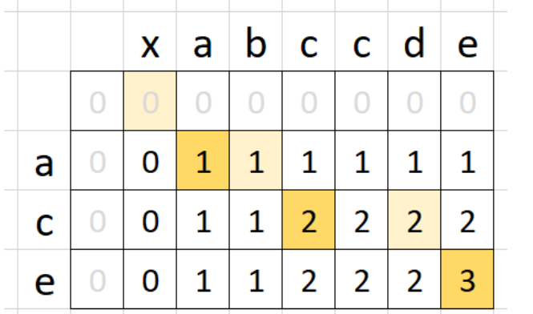

# 1143. Longest Common Subsequence
[Leetcode 1143. Longest Common Subsequence](https://leetcode.com/problems/longest-common-subsequence/)

## Approach 1 : Dynamic Programming (Bottom-UP)
Bottom-up DP utilizes a matrix `m` where we track `LCS` sizes for each combination of `i` and `j`.
* If `a[i] == b[j]`, LCS for `i` and `j` would be `1 plus LCS` till the `i-1` and `j-1` indexes.
* Otherwise, we will take the largest LCS if we skip a charracter from one of the string `(max(m[i - 1][j], m[i][j - 1])`.
This picture shows the populated matrix for `xabccde`, `ace` test case.


```cpp
class Solution {
public:
    int longestCommonSubsequence(string text1, string text2) {
        int m = text1.size(), n = text2.size();
        
        vector<vector<int>> dp(m+1, vector<int>(n+1, 0));
        for (int i = 1; i <= m; i++) {
            for (int j = 1; j <= n; j++) {
                if (text1[i-1] == text2[j-1]) {
                    dp[i][j] = 1 + dp[i-1][j-1];
                } else {
                    dp[i][j] = max(dp[i][j-1], dp[i-1][j]);
                }
            }
        }
        return dp[m][n];
    }
};
```
### Complexity
* Time : `O(M * N)`
* Space : `O(M * N)`

## Approach 2 : Memory Optimized
```cpp
class Solution {
public:
    int longestCommonSubsequence(string text1, string text2) {
        int m = text1.size(), n = text2.size();
        
        vector<vector<int>> dp(2, vector<int>(n+1, 0));
        for (int i = 1; i <= m; i++) {
            for (int j = 1; j <= n; j++) {
                if (text1[i-1] == text2[j-1]) {
                    dp[i%2][j] = 1 + dp[(i-1)%2][j-1];
                } else {
                    dp[i%2][j] = max(dp[i%2][j-1], dp[(i-1)%2][j]);
                }
            }
        }
        return dp[m%2][n];
    }
};
```
## Approach 3 : Further Space Optimized
```cpp
class Solution {
public:
    int longestCommonSubsequence(string text1, string text2) {
        int m = text1.size(), n = text2.size();
        
        int prev_val, curr_val;
        vector<int> dp(n+1, 0);
        for (int i = 1; i <= m; i++) {
            prev_val = 0;
            for (int j = 1; j <= n; j++) {
                curr_val = dp[j];
                dp[j] = max({dp[j], dp[j-1], prev_val + (text1[i - 1] == text2[j - 1])});
                prev_val = curr_val;
            }
        }
        return dp[n];
    }
};
```
### Complexity 
* Time :`O(M * N)`
* Space : `O(N)`
