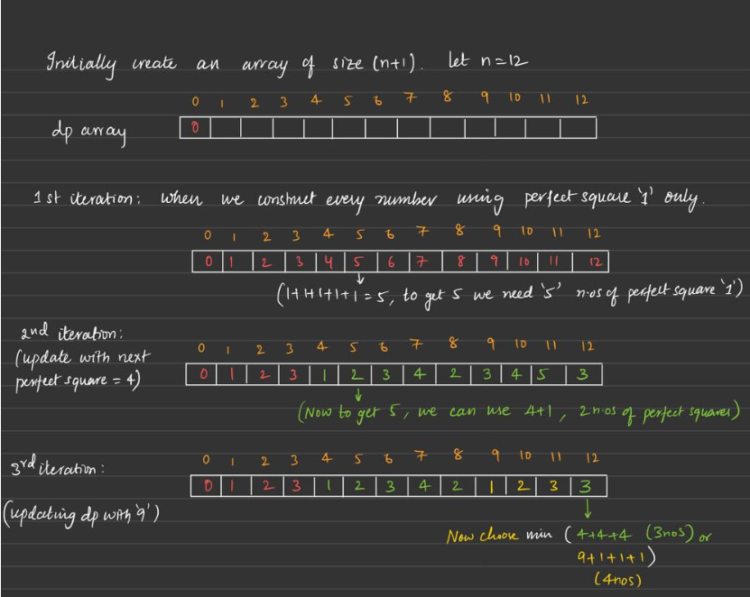

# 279. Perfect Squares
[Leetcode 279. Perfect Squares](https://leetcode.com/problems/perfect-squares/)

## Solution : Dynamic Programming


```cpp
class Solution {
public:
    int numSquares(int n) {
        vector<int> dp(n+1, INT_MAX);
        
        dp[0] = 0;
        
        int count  = 1;
        
        while (count * count <= n) {
            int sq = count * count;
            for (int i = sq; i <= n; i++) {
                dp[i] = min(dp[i - sq] + 1, dp[i]);
            }
            count++;
        }
        return dp[n];
    }
};
```
### Complexity
* Time : `O(N * sqrt(N)`
* Space : `O(N)`
