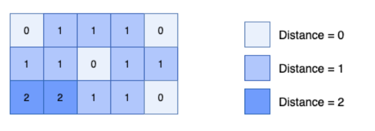

# 542. 01 Matrix

[Leetcode 542. 01 Matrix](https://leetcode.com/problems/01-matrix/)

# Approach 1 : BFS on zero cells first
* For convinience, let's call the cell with value 0 as zero-cell, the cell has with value `1` as one-cell, the distance of the nearest `0` of a cell as distance.
* Firstly, we can see that the distance of all zero-cells are `0`.
* Same idea with `Topology Sort`, we process zero-cells first, then we use queue data structure to keep the order of processing cells, so that cells which have the smaller distance will be processed first. Then we expand the unprocessed neighbors of the current processing cell and push into our queue.
Afterall, we can achieve the minimum distance of all cells in our matrix.


```cpp
class Solution {
public:
    vector<int> DIR = {0, 1, 0, -1, 0};
    vector<vector<int>> updateMatrix(vector<vector<int>>& mat) {
        int m = mat.size(), n = mat[0].size();
        queue<pair<int, int>> q;
        for (int r = 0; r < m; ++r)
            for (int c = 0; c < n; ++c)
                if (mat[r][c] == 0) q.emplace(r, c);
                else mat[r][c] = -1; // Marked as not processed yet!

        while (!q.empty()) {
            auto [r, c] = q.front(); q.pop();
            for (int i = 0; i < 4; ++i) {
                int nr = r + DIR[i], nc = c + DIR[i+1];
                if (nr < 0 || nr == m || nc < 0 || nc == n || mat[nr][nc] != -1) continue;
                mat[nr][nc] = mat[r][c] + 1;
                q.emplace(nr, nc);
            }
        }
        return mat;
    }
};
```
## Complexity
* Time: `O(M * N)`, where `M` is number of rows, `N` is number of columns in the matrix.
* Space: `O(M * N)`, space for the queue.

## Approach 2 : Dynamic Programming
* For convinience, let's call the cell with value `0` as zero-cell, the cell has with value `1` as one-cell, the distance of the nearest `0` of a cell as distance.
* Firstly, we can see that the distance of all zero-cells are `0`, so we skip zero-cells, we process one-cells only.
* In DP, we can only use prevous values if they're already computed.
* In this problem, a cell has at most `4` neighbors that are `left, top, right, bottom`. If we use dynamic programming to compute the distance of the current cell based on `4` neighbors simultaneously, it's impossible because we are not sure if distance of neighboring cells is already computed or not.
That's why, we need to compute the distance one by one:
* Firstly, for a cell, we restrict it to only `2` directions which are `left and top`. Then we iterate cells from top to bottom, and from left to right, we calculate the distance of a cell based on its left and top neighbors.
* Secondly, for a cell, we restrict it only have `2` directions which are `right and bottom`. Then we iterate cells from bottom to top, and from right to left, we update the distance of a cell based on its right and bottom neighbors.


```cpp
class Solution {
public:
    vector<vector<int>> updateMatrix(vector<vector<int>> &mat) {
        int m = mat.size(), n = mat[0].size(), INF = m + n; // The distance of cells is up to (M+N)
        for (int r = 0; r < m; r++) {
            for (int c = 0; c < n; c++) {
                if (mat[r][c] == 0) continue;
                int top = INF, left = INF;
                if (r - 1 >= 0) top = mat[r - 1][c];
                if (c - 1 >= 0) left = mat[r][c - 1];
                mat[r][c] = min(top, left) + 1;
            }
        }
        for (int r = m - 1; r >= 0; r--) {
            for (int c = n - 1; c >= 0; c--) {
                if (mat[r][c] == 0) continue;
                int bottom = INF, right = INF;
                if (r + 1 < m) bottom = mat[r + 1][c];
                if (c + 1 < n) right = mat[r][c + 1];
                mat[r][c] = min(mat[r][c], min(bottom, right) + 1);
            }
        }
        return mat;
    }
};
```
