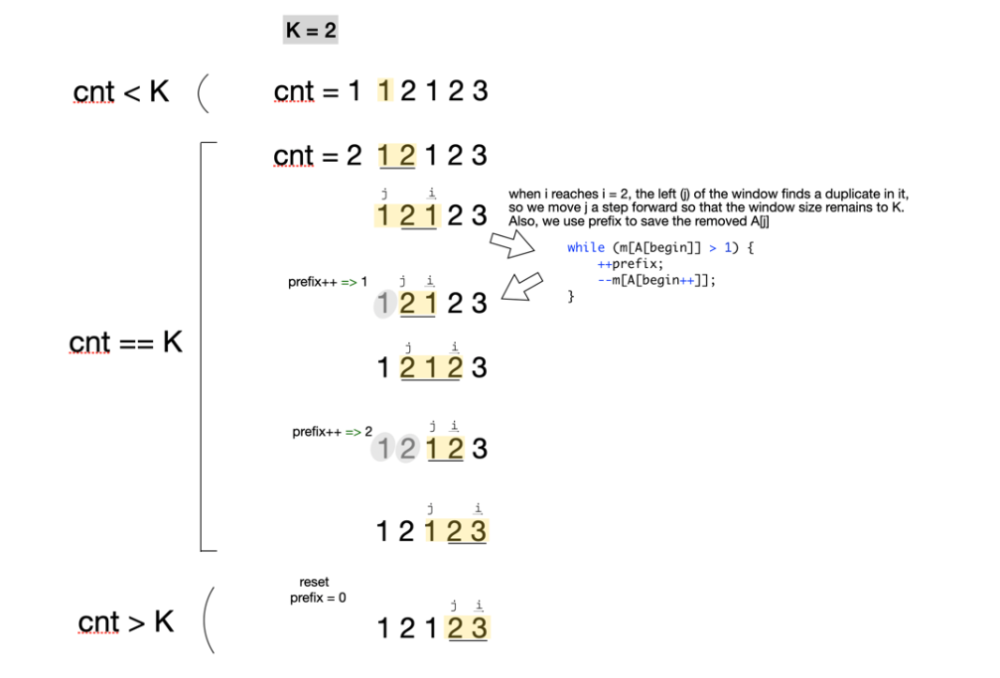

# 992. Subarrays with K Different Integers
[Leetcode 992. Subarrays with K Different Integers](https://leetcode.com/problems/subarrays-with-k-different-integers/)

## Solution:
When you move the right cursor, keep tracking whether we have reach a count of K distinct integers, if yes, we process left cursor,
here is how we process left cursor:

Check whether the element pointed by left cursor is duplicated in window, if yes, we remove it, and use a variable (e.g. prefix) to 
record that we have removed an element from the window). keep this process until we reduce the window size from to exactly K. now we 
can calculate the number of valid good array as res += prefix;

After process left cursor and all the stuff, the outer loop will continue and right cursor will move forward, and then the window 
size will exceed K, we can simply drop the left most element of the window and reset prefix to 0. and continue on.

## Complexity Analysis
Time: `O(N)`, where `N` is the length of A. Space: `O(N)`.

```cpp
class Solution {
public:
    int subarraysWithKDistinct(vector<int>& A, int K) {
        int res = 0;
        vector<int> m(A.size() + 1);
        int end = 0, begin = 0, prefix = 0, cnt = 0;
        
        while (end < A.size()) {
            if (m[A[end++]]++ == 0) cnt++;
            if (cnt > K) {
                --m[A[begin++]];
                --cnt;
                prefix = 0;
            }
            while (m[A[begin]] > 1) {
                ++prefix;
                --m[A[begin++]];
            }
            if (cnt == K) {
                res += prefix + 1;
            }
        }
        return res;
    }
};
```
